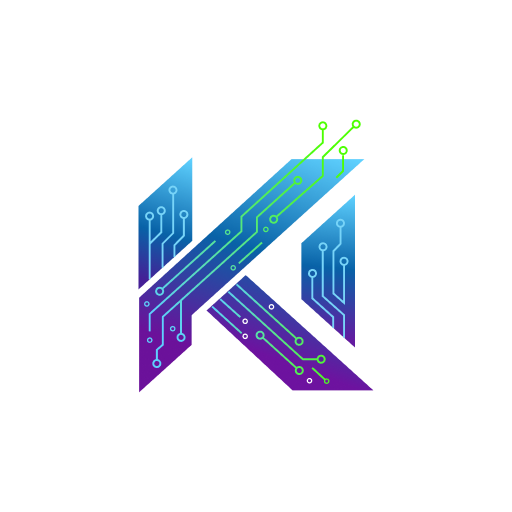

<p align="center">
  <picture>
    <source media="(prefers-color-scheme: dark)" srcset="assets/logo-full-dark.svg">
    <source media="(prefers-color-scheme: light)" srcset="assets/logo-full-light.svg">
    
  </picture>
</p>

<p align="center">
  <strong>Marketing site for NestWeaver — <a href="https://nestweaver.kehl.io">nestweaver.kehl.io</a></strong>
</p>

<p align="center">
  <a href="https://github.com/Kehl-io/nestweaver-website/actions/workflows/ci.yml"></a>
  <a href="https://github.com/Kehl-io/nestweaver-website/blob/main/LICENSE"></a>
</p>

---

## Tech Stack

- **Astro 5** — static site generation
- **Tailwind v4** — styling via Vite plugin
- **TypeScript** — type-safe components
- **Satori + resvg** — OG image generation
- **Cloudflare Pages** — hosting and deployment

## Prerequisites

- Node 24+

## Local Development

```sh
npm install
npm run dev
```

## Build

```sh
npm run build
```

Output goes to `dist/`.

## Check Suite

```sh
npm run lint && npm run type-check && npm run build
```

## Deployment

Automated via GitHub Actions:

- Push to `main` triggers [release-please](https://github.com/googleapis/release-please) to create/update a release PR.
- Merging a version tag triggers a Cloudflare Pages deploy.
- PRs get preview deploys with unique URLs.

## Links

- **Live site:** https://nestweaver.kehl.io
- **NestWeaver repo:** https://github.com/Kehl-io/nestweaver
- **Docs site:** https://docs.nestweaver.kehl.io

## License

[MIT](LICENSE)

---

<p align="center">
  <a href="https://kehl.io">
    
  </a>
  <br>
  <sub>Built by <a href="https://kehl.io">kehl.io</a></sub>
</p>
